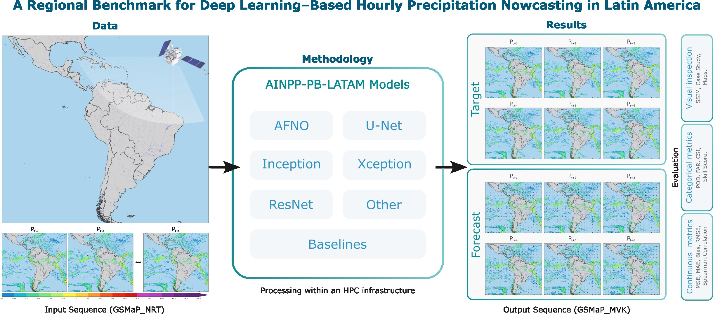

<div align="center">
  
  <br /> <br />

  [](https://doi.org/10.1109/ACCESS.2026.3670767)
  
  [](https://github.com/SInApSE-INPE/AINPP-PB-LATAM/actions/workflows/ci.yml)
  [](https://pypi.org/project/ainpp-pb-latam/)
  [](https://github.com/SInApSE-INPE/AINPP-PB-LATAM/releases)
  

  <br />

  # AINPP Precipitation Benchmark

  _Unified scientific benchmark library for precipitation nowcasting in Latin America using deep learning on high-performance computing (HPC) environments._
  <br />
</div>

## Key Features

- **Extensive Model Zoo**: AFNO, ConvLSTM, GAN, InceptionV4, ResNet50, UNet, and Xception.
- **Scalable HPC Training**: Built-in support for Single GPU, Multi-GPU (Distributed Data Parallel), and Multi-Node clusters.
- **Standardized Data Formats**: Optimized data loading and processing utilizing Zarr archives with daily/hourly grid matrices.
- **Config-Driven Architecture**: Fully modular, parameterized via Hydra to completely decouple code from experiments.
- **Metrics & Evaluation**: Three-pronged evaluation module covering Spatial, Continuous, and Probabilistic metrics.

---

## 🛠 Tech Stack

- **Language**: Python 3.10+
- **Deep Learning**: PyTorch, Torchvision, TIMM
- **Experiment Tracking**: MLflow
- **Configuration**: Hydra, OmegaConf
- **Data Processing**: Zarr, Xarray, Dask, Pandas, Numpy
- **Metrics & Science**: Scikit-Learn, SciPy
- **Package Manager**: `uv`

---

## Prerequisites

- Python 3.10 or higher.
- NVIDIA GPUs available (CUDA environment) for practical training and evaluation.
- `uv` installed on the system (a blazing-fast Python package installer and resolver).

---

## Getting Started

### 1. Clone the Repository

```bash
git clone https://github.com/user/ainpp-pb-latam.git
cd ainpp-pb-latam
```

### 2. Set Up the Environment

The project relies on `uv` to maintain its isolated environment. Create a virtual environment:

```bash
uv venv
```

Activate the environment:

```bash
# On Linux/macOS
source .venv/bin/activate
```

### 3. Install Dependencies

**CRITICAL**: The package must always be installed in editable mode (`-e`) using `uv`. Do not use `sys.path` hacks in your experiments.

```bash
# Install the core package along with dev and docs dependencies
uv pip install -e .[dev,docs]
```

### 4. Verify Installation

You can check if the CLI is ready and Hydra configuration is locatable:

```bash
python main.py --help
```

---

## Architecture Overview

### Data Constraints & Design
The benchmark operates under strict spatio-temporal properties tailored for the Brazilian/Latin-American precipitation models:
- **Base Format**: `.zarr` file stores.
- **Data Splits**: 
  - `train`: 2018 to 2022
  - `validation`: 2023
  - `test`: 2024
- **Structural Properties**: 
  - Matrices of `880 x 970` spatial grids.
  - Hourly granularity.
- **Temporal Configuration**:
  - Input: 12 consecutive hours originating from `gsmap_nrt`.
  - Target (Prediction): 6 consecutive hours pointing to `gsmap_mvk`.
- **Training Strategies**: Models can be trained using either an **Autoregressive** (predict 1 step, feed-back, repeat) or **Direct** (predict all 6 steps at once) approach.

### Directory Structure

```
├── conf/                     # Hydra configuration YAMLs
│   ├── config.yaml           # Root configuration
│   ├── dataset/              # Dataloader & data path configs
│   ├── discriminator/        # GAN discriminators (e.g. patchgan)
│   ├── evaluation/           # Evaluation metric definitions
│   ├── loss/                 # Loss functions (e.g., mse, ssim)
│   ├── model/                # Architecture configurations (unet, afno, etc.)
│   ├── training/             # Optimizer, lr scheduler, epochs
│   └── visualization/        # Plotting parameters
├── docs/                     # MkDocs documentation
├── scripts/                  # Utilities (legacy running blocks, bash scripts)
│   ├── check_all.sh          # Full quality-gate workflow
│   └── enforce_coverage.py   # Coverage tools
├── src/
│   └── ainpp_pb_latam/                # Core Python package
│       ├── datasets/         # Zarr loading and sampling logic
│       ├── evaluation/       # Orchestration & benchmark metric calculators applied per threshold/lead_time
│       ├── metrics/          # Pure mathematical calculations agnostic of batch/dataset
│       ├── aggregation/      # Statistical grouping and Tidy dataframe formatting (CSV/Parquet)
│       ├── visualization/    # Handlers for model output plotting (Curves, Diagrams, Maps)
│       ├── inference/        # Unified inference engine for single/historical predictions
│       ├── layers/           # Reusable neural network layers
│       ├── models/           # Model Zoo definitions (UNet, ResNet, etc.)
│       ├── distributed.py    # DDP sync rules for Multi-Node
│       ├── engine.py         # Standard training loops
│       ├── engine_gan.py     # specialized loops for GAN-based setups
│       ├── losses.py         # Specialized precipitation loss implementations
│       └── utils.py          # Object builders (Loss, Optimizer)
├── tests/                    # Pytest suite
├── main.py                   # Unified CLI Entry point
├── pyproject.toml            # Build system definitions
└── uv.lock                   # Deterministic python dependency tree
```

### Evaluation & Metrics Workflow

The library features rigorously separated pipelines for scientific benchmark evaluation. The architecture divides concerns as follows:

1. **`metrics/`**: Computes pure mathematical metrics. Subdivided into 6 categories based on standard precipitation forecasting properties:
   - **Categorical** (*POD, FAR, CSI, ETS, FSS*)
   - **Continuous** (*MAE, RMSE, ME, Pearson Correlation*)
   - **Probabilistic** (*Brier Score, ROC-AUC, CRPS*)
   - **Object-Based** (*Object CSI, centroid distance for convective cells*)
   - **Sharpness / Blur** (*SSIM, Total Variation, PSD*)
   - **Consistency** (*Wasserstein distance, Exceedance curves*)
2. **`evaluation/`**: Orchestrates and maps the raw output target against the thresholds (`mm/h`) and temporal prediction horizons (`lead_time`).
3. **`aggregation/`**: Consolidates statistical properties from the evaluation bounds and builds Tidy long dataframes exportable to both `CSV` and `Parquet`.
4. **`visualization/`**: Generates diagnostic visual figures over the aggregated benchmark sets directly into the `outputs/figures` directories. Supported plots are:
   - Error & Lead Time continuous curves
   - Performance and Taylor Diagrams
   - Model Ranking grids and Heatmaps
   - CDFs, Histogram Distribution mapping and Spatiotemporal spectral visuals.

### Using the Evaluation Modules

The benchmark evaluation generates metrics and plots automatically, but gives you total control via the CLI or Python API.

#### Running standard evaluation
Execute the unified evaluation over your best model checkpoint:
```bash
python main.py task=evaluate checkpoint=outputs/pipelines/unet_direct/checkpoints/best_model.pt
```

#### Customizing parameters via Hydra
Overwrite constraints seamlessly to test custom thresholds (e.g., severe storms) or ignore specific modules to speed up processing:
```bash
python main.py task=evaluate \
  model=unet/direct \
  checkpoint=outputs/my_model.pt \
  +evaluation.thresholds_mm_h=[5.0, 10.0, 25.0] \
  +evaluation.lead_times_min=[10, 30, 60] \
  +evaluation.probabilistic=false \  # Turn off probabilistic evaluation
  +visualization.output_dir=/custom/plot/path
```

#### Calling metrics and visualization dynamically
You can utilize the highly optimized standalone packages on your custom prediction loops or notebooks without the Hydra wrapper:

```python
import numpy as np
from ainpp_pb_latam.metrics.continuous import ContinuousMetrics
from ainpp_pb_latam.metrics.categorical import CategoricalMetrics
from ainpp_pb_latam.visualization.plot_maps import plot_comparison

target_map = np.random.rand(256, 256) * 15 # Synthetic observed mm/h
pred_map = target_map * 0.8 + np.random.rand(256, 256) # Synthetic predicted mm/h

# 1. Compute Math metrics agnostic to thresholds
cont_metrics = ContinuousMetrics.compute(pred_map, target_map)
print(f"RMSE: {cont_metrics['RMSE']:.2f}")

# 2. Compute Categorical metrics for heavy rain (> 10mm/h)
cat_metrics = CategoricalMetrics.compute(pred_map, target_map, threshold=10.0)
print(f"CSI (Threat Score): {cat_metrics['CSI']}")

# 3. Export sharp comparison maps
plot_comparison(
    target=target_map, 
    prediction=pred_map, 
    output_path="comparison_maps.png", 
    title="Heavy Rain Analysis"
)
```

### Request Lifecycle

1. You run `python main.py task=<TASK_TYPE>`.
2. **Hydra** merges `conf/config.yaml` with the sub-dictionaries provided (loss, models, training parameters) and command-line overrides.
3. Depending on the task (`train`, `evaluate`, `infer`):
   - Initializes the Zarr Datasets via `ainpp_pb_latam.datasets`.
   - Compiles the Model defined in `conf/model/` and ships it to GPU (or configures `DistributedDataParallel`).
   - Hooks into `ainpp_pb_latam.engine`, `ainpp_pb_latam.evaluation` or `ainpp_pb_latam.inference` and streams data until completion.

---

## Configuration via Hydra

This project delegates all configurations (hyperparameters, variables, dataset paths, training parameters) to **Hydra**. We do **not** use `argparse` or `.env` files for architecture controls.

### Modifying Parameters
You can override any parameter on the command line using the simple `.yaml` trajectory:

```bash
# Change the learning rate and batch size for a training run:
python main.py task=train training.lr=0.0005 dataset.train_loader.batch_size=32

# Change the model to an AFNO and loss to a Hybrid scheme:
python main.py task=train model=afno loss=hybrid_mse_ssim
```

### Understanding Loss Functions
We provide specialized loss functions designed for high-intensity precipitation tasks:
- **Pixel-wise**: `WeightedMSE` (penalizes heavy rain errors), `LogCosh`, `HuberLoss`.
- **Structural**: `SSIMLoss` (anti-blurring), `SpectralLoss`, `PerceptualLoss` (Feature MSE).
- **Hybrid**: `HybridLoss` (configurable weighted summation).

---

## Available Commands

Run any stage via `main.py`.

| Command | Description |
|---|---|
| `python main.py task=train` | Kickoff training. By default outputs runs to `./outputs/<date>/<time>`. |
| `python main.py task=evaluate checkpoint=/path/to/my_model.pt` | Run spatial, continuous, and probabilistic metric validation on the held-out test data. |
| `python main.py task=infer inference.mode=single checkpoint=/my_model.pt` | Run prediction for a single isolated sample and output locally formatted as `.nc` (NetCDF) or `.pt`. |
| `python main.py task=infer inference.mode=historical checkpoint=/my_model.pt` | Run bulk batch-by-batch predictions on the whole temporal set via Dataloader, saving cleanly optimized to a Zarr Store. |
| `./scripts/check_all.sh` | Run all Linters, typecheck, and coverage reports at once. |
| `mkdocs serve` | Host documentation locally mimicking github pages structure. |

---

## Testing

Quality assurance is mandated globally via the Makefile/Shell scripts. We rely on `pytest`, `coverage`, `black`, `isort`, and `mypy`.

### Running Tests

```bash
# Run all automated tests (Minitest equivalent in Python)
pytest tests/

# Run tests with coverage map pointing at src/ainpp_pb_latam
pytest --cov=src/ainpp_pb_latam tests/

# Shortcut for linting, typing and testing standardly
./scripts/check_all.sh
```

---

## Training and Deployment in HPC Workspace

The framework utilizes `torch.distributed` and is meant to be run transparently on massive multi-GPU or multi-Node bounds. 

### Single Node, Multi GPU Deployment
Run the process under `torchrun` and declare how many GPUs to map per node:

```bash
# Running DDP with 4 GPUs
torchrun --nproc_per_node=4 main.py task=train dataset.train_loader.batch_size=16
```
*(Variables are aggregated per-batch across GPUs, keeping the effective batch-size as GPUs * node_batch_size).*

### Compute / Checkpointing Rules
- **Early Stopping**: Models monitor validation loss. If improvement ceases before parameter `patience`, training terminates.
- **Checkpointing**: Every epoch emits a checkpoint, defaulting the minimum validation loss state to `best_model.pt`.

---

## Troubleshooting

### ImportErrors on ainpp_pb_latam.*
**Error**: `ModuleNotFoundError: No module named 'ainpp_pb_latam'`
**Solution**: Ensure you actually installed the package into the current uv environment via the editable command.
```bash
uv pip install -e .
```

### CUDA out of memory
**Error**: `torch.cuda.OutOfMemoryError / CUDA out of memory.`
**Solution**: Drop the batch size or hidden dimensions through Hydra.
```bash
python main.py task=train dataset.train_loader.batch_size=4 model.hidden_channels=[16,16,16]
```

### Deadlocks in DistributedDataParallel
**Error**: The system freezes on epoch conclusion or validation phases.
**Solution**: DDP often hangs if the dataset isn't perfectly sliced, or if evaluation metrics attempt to reduce uneven tensors. Try lowering the number of workers per dataloader using `system.num_workers=0` for debug traces.

## Acknowledgements

The authors wish to thank the National Council for Scientific and Technological Development (CNPq, processes 438310/2018-7, 141451/2021-1 and 444205/2024-1), the Brazilian Federal Agency for Support and Evaluation of Higher Education (CAPES), the National Institute for Space Research (INPE) and the Brazilian Space Agency (AEB) of the Ministry of Science, Technology and Innovation (MCTI) for their financial support. The project was supported by the \textit{Laboratório Nacional de Computação Científica} (LNCC, MCTI/Brazil) through the resources of the Santos Dumont supercomputer in the projects IDeepS and CPTEC. This work was also supported by the 4th Research Announcement on the Earth Observations of the Japan Aerospace Exploration Agency (JAXA) (ER4GPN102) and World Meteorological Organization (WMO).

## License

This architecture operates under an MIT open-source license.

## Citation

If you use this benchmark in your research, please cite the following paper:

```bibtex
@article{almeida2026regional,
  author  = {Almeida, Adriano P. and Barbosa, Henrique M. J. and Garcia, S{\^a}mia R. and Gagne, David J. and Zhou, Kanghui and Kubota, Takuji and Ushio, Tomoo and Otsuka, Shigenori and Pfreundschuh, Simon and Calheiros, Alan J. P.},
  title   = {A Regional Benchmark for Deep Learning-Based Hourly Precipitation Nowcasting in Latin America},
  journal = {IEEE Access},
  year    = {2026},
  volume  = {PP},
  number  = {99},
  pages   = {1--1},
  doi     = {10.1109/ACCESS.2026.3670767}
}
```
